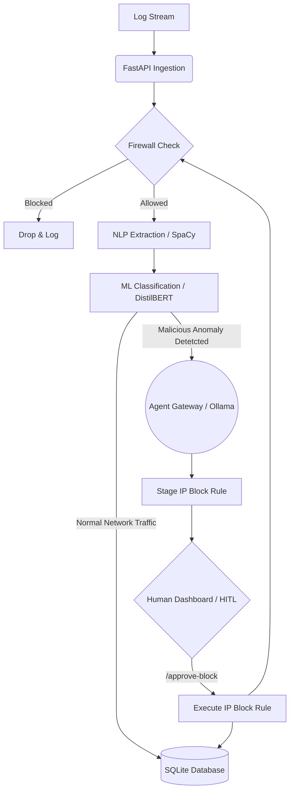

# NetOps-AI Agent

## Project Description

NetOps-AI Agent is an intelligent, automated network operations and security monitoring system. The platform is designed to ingest raw network logs in real-time, analyze them for potential cyber attacks or anomalies, and take automated remediation actions—all while keeping humans in the loop when necessary. 

By utilizing state-of-the-art AI technologies like Natural Language Processing (NLP) and Machine Learning (ML), alongside a secure Agent Gateway for reasoning, the platform dramatically reduces response times to potential threats.

## Key Highlights

- **Intelligent Log Ingestion**: Uses a high-performance FastAPI backend to receive log streams securely.
- **NLP Entity Extraction**: Employs **SpaCy** (via an `en_core_web_sm` model and a custom EntityRuler) to reliably parse complex, unstructured log texts and extract actionable data such as Protocol Types and IP Addresses.
- **Zero-Shot ML Anomaly Detection**: Uses a PyTorch-backed **DistilBERT** Zero-Shot classification pipeline to flag potential network attacks or failures with a calculated confidence score without the need for extensive traditional rule writing. 
- **Isolated AI Agent Gateway**: Upon attack detection, logs are routed to a containerized Secure Agent Gateway (OpenClaw Agent) backed by **Ollama (llama3.2:1b)**. The agent independently reviews the threat and proposes or stages defense strategies.
- **Human-in-the-Loop Override & Virtual Firewall**: Includes endpoints for humans to securely review isolated agent findings and explicitly execute IP block requests, feeding data back into the system's virtual firewall dynamically.

## System Design Pattern

The architecture of NetOps-AI Agent is built around a hybrid of the **Event-Driven Architecture**, a linear **AI Processing Pipeline**, and the **Human-in-the-Loop (HITL)** design pattern.

### 1. AI Processing Pipeline
Data flows through a direct, sequential pipeline strictly governing state:
* **Ingest → Firewall Check → NLP Entity Extraction → ML Attack Classification → Database Persist**.
This enforces that all AI evaluations (extraction and reasoning mapping) happen monotonically so that subsequent steps always have access to previously processed structured data. 

### 2. Event-Driven Agent Orchestration
When an anomaly exceeds the confidence threshold (e.g., >60% malicious probability), it fires an event to an isolated Microservice—the *Agent Server*. The main FastAPI service merely dispatches an untrusted log to the Agent Server via an HTTP request, completely decoupling the reasoning/tactic tier from the main ingestion pathway. 

### 3. Human-in-the-Loop (HITL) Pattern
The design heavily enforces security by staging autonomous decisions instead of blindly executing them. 
* The autonomous agent decides *if* a rule should be staged based on the `target IP` it extracted.
* It places this into a staging phase but requires an explicit `/approve-block` action triggered by a human administrator via the dashboard. 
* Once approved, the system delegates execution back to the agent using strict `"EXECUTE PREVIOUSLY STAGED RULE"` directives, completely shifting from open-ended reasoning to deterministic execution.