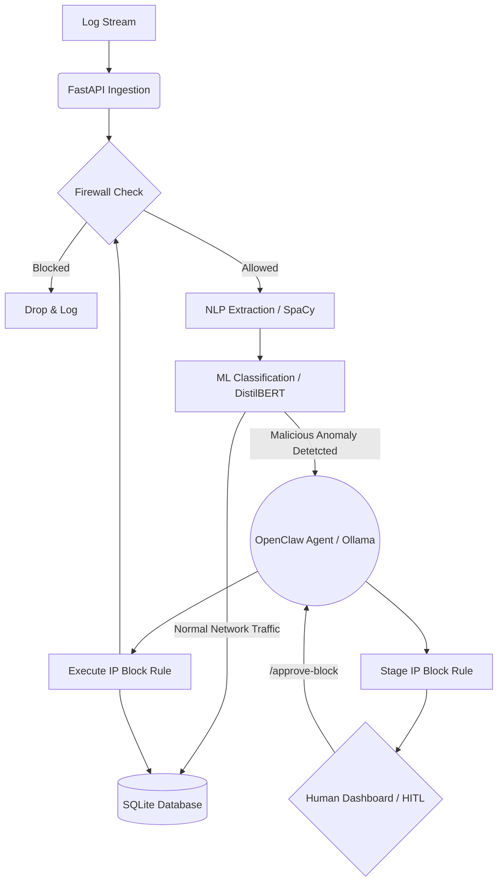

# NetOps-AI: Autonomous Security Operations Center 🛡️

## Project Description

NetOps-AI is a containerized, AI-driven Security Operations Center (SOC) that autonomously monitors network traffic, detects anomalies using Machine Learning, and deploys closed-loop automated firewall defenses using a local Large Language Model (LLM) and an Agentic framework.

By utilizing state-of-the-art AI technologies like NLP and ML, alongside a secure Agent Gateway (OpenClaw Agent) for reasoning, the platform dramatically reduces response times to potential threats.

## 🚀 Key Features

- **Real-time Traffic Ingestion:**: Uses a high-performance FastAPI backend to receive log streams securely.
- **Deep Learning Anomaly Detection:**: Utilizes a PyTorch Hugging Face model `(distilbert-base-uncased-mnli)` for `zero-shot classification` to detect brute-force attacks and network anomalies.
- **Local LLM Integration**: Leverages **Ollama (llama3.2:1b)** running locally to analyze threats and provide human-readable incident context without relying on paid cloud APIs.
- **Isolated AI Agent**: Uses `OpenClaw` inside a secure, isolated Docker container to propose and execute network firewall blocks automatically.
- **Human-in-the-Loop (HITL) Dashboard**: A custom-built, dark-mode SOC web interface allowing security engineers to monitor traffic and approve/deny AI-staged firewall rules.
- **CI/CD Pipeline**: Fully integrated `GitHub Actions` workflow for automated Pytest execution.

## System Design Pattern

The architecture of NetOps-AI Agent is built around a hybrid of the **Event-Driven Architecture**, a linear **AI Processing Pipeline**, and the **Human-in-the-Loop (HITL)** design pattern.



🏗️ System Architecture

- **Log Generator**: Simulates normal network traffic and targeted `Brute Force/DDoS` attacks.
- **FastAPI Virtual Firewall**: Intercepts traffic, blocking known bad IPs instantly from an in-memory cache and live `firewall_rules.txt` file.
- **ML Inference Engine**: Evaluates unblocked traffic using `zero-shot` deep learning models.
- **OpenClaw Agent Gateway (Docker)**: If an anomaly is detected, the log is securely passed to the containerized `OpenClaw` Agent.
- **LLM Analysis**: The Agent consults `Llama 3.2` to extract the attacker's IP and proposes a staging rule.
- **SOC Dashboard**: The UI displays the pending threat. Upon Human Approval, the FastAPI server delegates execution authority back to the `OpenClaw` Agent.
- **Execution**: The Agent applies the live block, and the network is secured.

🛠️ Tech Stack

- **Language**: Python 3.11
- **API Framework**: FastAPI, Uvicorn
- **Machine Learning**: PyTorch, Hugging Face Transformers, SpaCy
- **AI Agent**: OpenClaw, Ollama (Llama 3.2 / Qwen)
- **DevOps / MLOps**: Docker, Docker Compose, GitHub Actions, Pytest

## How to Run Locally
1. Clone the repository
```
git clone [https://github.com/mahfuz-raihan/netops-ai-agent.git](https://github.com/mahfuz-raihan/netops-ai-agent.git)
cd netops-ai-agent
```
2. Start the OpenClaw Docker Agent
```
docker-compose up --build
```
3. Install Python Dependencies (in a separate terminal)
```
pip install -r requirements.txt
```
4. Start the FastAPI Backend
```
uvicorn main:app --reload
```
5. Open the SOC Dashboard Double-click the `index.html` file in your browser.
6. Start the Network Simulator
```
python log_generator.py
```

## 🧪 Testing
This project includes automated testing for the API endpoints and ML processing logic. Run tests using:
```
pytest test_main.py -v
```


